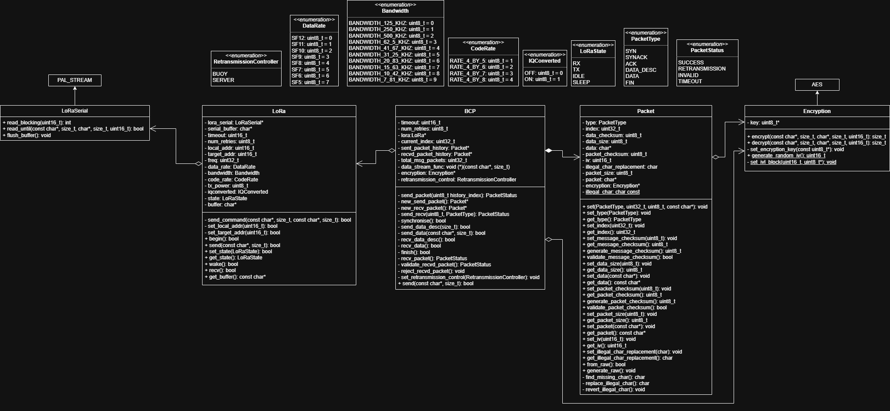
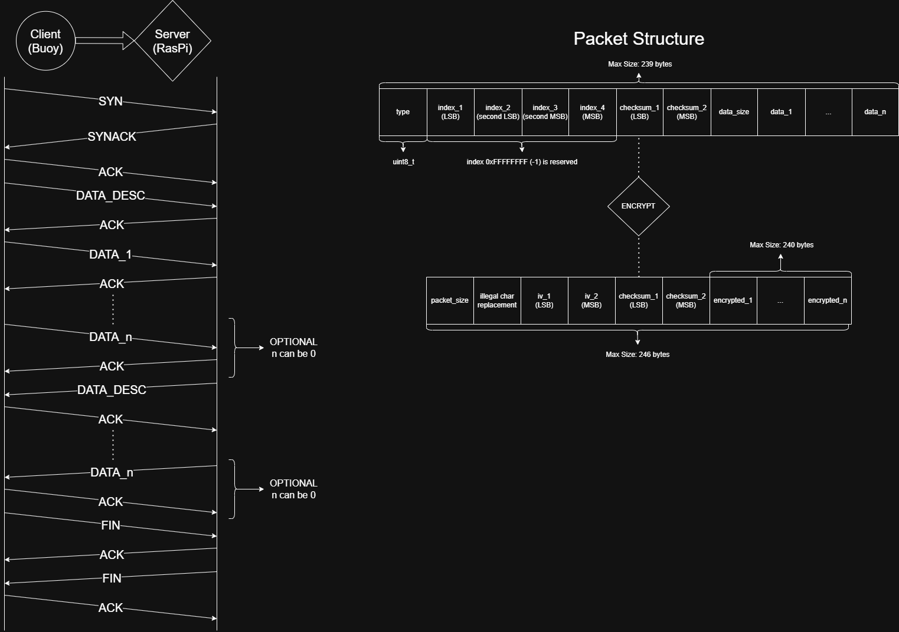

# Ocean Weather Buoy


An autonomous, low-power marine telemetry buoy and ground station system designed for real-time monitoring of environmental indicators (air/water temperature, humidity, atmospheric pressure, UV radiation) and wave dynamics (swell height, period, and direction). The system features a custom STM32 firmware stack, a custom transport-layer communication protocol (BCP) over LoRa, secure AES encryption, and a robust over-the-air (OTA) bootloader partitioning scheme.

---

## System Architecture & Diagrams

The project is structured into a Remote Buoy Node and a Ground Station Server. Below are the architectural diagrams outlining the system relationships and communication sequence:

### Buoy Object Diagram


### BCP Networking Protocol Diagram


---

## Firmware Architecture & Low-Power Operations

To survive on solar-charged batteries in unattended marine environments, the buoy firmware executes a strict event-driven duty cycle managed by an external Real-Time Clock (RTC) alarm.

### Execution Path
1. **RTC Wakeup**: The MCU resides in deep Stop/Shutdown mode to minimize current draw. An RTC alarm interrupt triggers a wakeup.
2. **Hardware Check & Fault Isolation**: The MCU initializes core system buses (I2C, OneWire, ADC). If a peripheral or sensor fails to initialize within a designated retry limit, the system isolates the fault, logs the failure, and continues to prevent a complete system lock.
3. **IMU Wave Profiling**: If the current interval is scheduled for wave analysis, the BNO085 IMU is enabled. The system samples pitch, roll, and linear acceleration at **10 Hz** for 30 seconds, buffering and logging the stream to `imu_data.bin` on the SD card.
4. **Environmental Logging**: Environmental sensors are read in sequence. The telemetry data is packed into a high-density binary format and written to `sensor_data.bin`.
5. **Telemetry Upload**: The LoRa transceiver is initialized, and the BCP handshake is executed to stream the logs to the ground station.
6. **OTA Update Check**: The firmware checks the SD card for verified update binaries. If an update is ready, the system jumps to the flash update routine.
7. **Standby Transition**: The RTC alarm is programmed for the next wake interval, peripheral power rails are disabled, and the MCU re-enters Stop/Shutdown mode.

---

## Buoy Communication Protocol (BCP)

The Buoy Communication Protocol (BCP) is a custom transport-layer protocol adapted from TCP, designed to provide reliable, packetized, and encrypted data transfer over unreliable, low-bandwidth wireless links (LoRa/Wi-Fi/Bluetooth).

### Features
* **Handshake and Tear-down**: Robust connection synchronization (`SYN` -> `SYNACK` -> `ACK`) and connection termination (`FIN` -> `ACK`).
* **Sliding Window & Flow Control**: Chunked data transmission with sequence numbering, acknowledgment verification, and duplicate drop handling.
* **Low-Overhead Packet Formatting**: Optimized byte layout to fit within the physical payload limits of LoRa frames (max 256 bytes) without sacrificing security.
* **AES-128 Cryptographic Protection**: Payload encryption using AES-128 in CBC mode, with a unique 16-bit Initialization Vector (IV) generated for each frame to prevent replay attacks.
* **Dual Checksum Verification**: Individual CRC16 checksums on both the unencrypted message (ensuring logic integrity) and the raw packet frame (detecting transport errors).

### Packet Structures

#### Raw Packet Frame Layout (Max 246 Bytes)
The physical frame transmitted over the air.

| Byte Offset | Field Name | Description |
|:---:|:---|:---|
| `0` | Packet Size | Total packet size (including overhead, max 246 bytes) |
| `1` | Illegal Char Replacement | Dynamic byte placeholder to replace illegal serial transmission character `\r` (`0x0D`) |
| `2-3` | Initialization Vector (IV) | 16-bit random IV (LSB first) for AES-128 CBC mode |
| `4-5` | Packet Checksum | 16-bit CRC16 checksum (LSB first) over the raw frame (excluding bytes 4-5) |
| `6+` | Encrypted Message Payload | AES-128 encrypted data containing the unencrypted message structure |

#### Decrypted Message Structure (AES Payload, Max 239 Bytes)
The decrypted structure parsed by the state machine.

| Byte Offset | Field Name | Description |
|:---:|:---|:---|
| `0` | Packet Type | Enumeration: SYN (`0`), SYNACK (`1`), ACK (`2`), DATA_DESC (`3`), DATA (`4`), FIN (`5`) |
| `1-4` | Packet Sequence Index | 32-bit sequential packet identifier (LSB first) |
| `5-6` | Message Checksum | 16-bit CRC16 checksum (LSB first) over the decrypted message contents (excluding bytes 5-6) |
| `7` | Data Size | Data payload size in bytes (max 231 bytes) |
| `8+` | Payload Data | Actual sensor telemetry or firmware update chunk payload |

### Dynamic Carriage Return (`\r`) Replacement
To prevent control flow corruption in the serial interface of AT-command-based LoRa modules (where `\r` triggers premature transmission or command processing), BCP implements a zero-overhead byte-stuffing scheme:
1. **Scans for Unused Byte**: The transmitter scans the constructed packet buffer to find an arbitrary byte value between `0x00` and `0xFF` (excluding `\r`) that is *not* present in the packet.
2. **Replaces Illegal Byte**: The unused byte is designated as the `Illegal Char Replacement` and placed at index 1 of the packet header. All instances of `\r` (`0x0D`) in the packet are replaced with this replacement character.
3. **Reverts on Reception**: The receiver reads the replacement byte and reverses the mapping before validation. This achieves full binary transparency with zero packet expansion.

### Connection Sequence (Textual Flow)

* **Phase 1: Synchronization Handshake**
  * Buoy transmits `SYN` packet (Sequence Index = 0).
  * Server responds with `SYNACK` packet (Sequence Index = 0).
  * Buoy responds with `ACK` packet (Sequence Index = 0) and transmits `DATA_DESC` packet (Sequence Index = 1) containing total transmission size metadata.
  * Server acknowledges description with `ACK` packet (Sequence Index = 1).

* **Phase 2: Stream Data Transfer**
  * Buoy loops through buffered files, transmitting `DATA` packets (Sequence Index = `k`) containing encrypted sensor telemetry chunks.
  * Server verifies and decrypts each packet, returning an `ACK` (Sequence Index = `k`) for each successful chunk.

* **Phase 3: Connection Finalization**
  * Buoy transmits `FIN` packet (Sequence Index = `N`).
  * Server responds with `ACK` packet (Sequence Index = `N`).
  * Server transmits `FIN` packet (Sequence Index = `N`).
  * Buoy responds with `ACK` packet (Sequence Index = `N`), releasing connection resources.

---

## Safe OTA Firmware Updater (Linker Partitioning)

The system implements a custom, failsafe Over-The-Air (OTA) firmware update system that can flash the MCU's primary memory while executing instructions.

### Hardware Constraint and Linker Solution
In standard ARM Cortex-M microcontrollers (like the STM32F303), writing to or erasing flash memory blocks the CPU or causes a `BusFault` if the CPU attempts to fetch instructions from the same flash memory bank being modified.

To solve this, a dual-partition linker structure was developed in the custom linker script [STM32F303K8TX_FLASH_modified.ld](STM32F303K8TX_FLASH_modified.ld):
* **Primary partition (`FLASH`)**: Addresses `0x08000000` to `0x0800B800` (46KB) - Reserves space for the main application.
* **Update partition (`FLASH_UPDATE`)**: Addresses `0x0800B800` to `0x0800FFFF` (18KB) - Houses the critical update routines (`FirmwareUpdater` and CRC verification helpers).

```
   0x08000000                                 0x0800B800           0x08010000 (64KB)
   +------------------------------------------+---------------------+
   |               FLASH                      |    FLASH_UPDATE     |
   |        (Primary Application)             |  (OTA Update Code)  |
   +------------------------------------------+---------------------+
```

Functions in the update engine are explicitly compiled into the `.firmware_update_section` using the `__FIRMWARE` macro defined in [firmware_update_linker.h](lib/FirmwareUpdater/firmware_update_linker.h):
```cpp
#define __FIRMWARE __attribute__((section(".firmware_update_section"), used, noinline))
```
These routines are physically stored in the `FLASH_UPDATE` segment. Because the CPU runs the update routine out of this separate region, it can safely unlock the flash controller, erase the primary `FLASH` partition pages, and write the new firmware image byte-by-byte.

### Safety Features
1. **Interrupt Guarding**: A local RAII guard disables all interrupts during update execution (`__disable_irq()`), preventing the CPU from jumping to ISR vectors located in the primary flash while it is being overwritten.
2. **Watchdog Refreshing**: The watchdog timer is fed within the flash page-erase loop to prevent system resets during long-duration flashing operations.
3. **Rolling CRC32 Verification**: Before executing the flash sequence, the binary image stored on the SD card (`fw.bin`) is verified against an expected CRC32 checksum. After flashing, the primary flash memory is read back and verified again before triggering an MCU reset. If the CRC32 check fails, the update is aborted, protecting the system from bricking.

---

### Battery Charging Circuit (Custom PCB)
The power system is based on a custom solar-charged NiMH battery system, integrating:
* **Thermal Cutoff**: Temperature sensors monitor battery temperature during peak solar cycles. If thermal limits are exceeded, charging is suspended via hardware comparator circuits to prevent thermal runaway.
* **Charging Current Control**: Active regulation of current inputs relative to solar panel voltage, protecting the NiMH battery chemistry and optimizing power extraction.

---

## Ground Station Implementation

The ground station software is built in Python and runs on a Linux host (e.g. Raspberry Pi) connected to a corresponding LoRa transceiver:
* **State Machine Parser**: Reconstructs data packets, checks CRC16 frame check sequences, handles duplicates, and manages BCP state transitions.
* **Decryption Engine**: Decrypts the raw packets using AES-128-CBC.
* **Data Logging**: Telemetry is structured, parsed, and logged to database structures for real-time visualization.
* **OTA Server Interface**: Allows operators to place update binaries (`fw.bin`) in the transmission queue, which are automatically streamed in chunks using the BCP protocol.

---

## Future Work

1. **ML-Based Swell Prediction**:
   - **Wave Spectrum Analysis**: Collect high-frequency IMU acceleration and orientation streams, compute the Power Spectral Density (PSD) using Fast Fourier Transforms (FFT), and estimate significant wave height (\(H_s\)) and peak wave period (\(T_p\)).
   - **On-Node Inference**: Deploy light-weight Machine Learning models (e.g., TinyML / TensorFlow Lite Micro models) to predict swell patterns directly on the STM32 nodes.
2. **LoRa Mesh Network Deployment**:
   - Transition from a star topology to a multi-hop mesh network using an AODV-like routing protocol. This will allow groups of buoys deployed over a large bay to relay messages through one another to reach a single ground station.

---

## Repository Structure

* [src/](src) - Contains the main application entry (`main_stm32.cpp`), high-level buoy logic (`buoy.cpp`), and custom assembly startup logic.
* [lib/](lib) - Project library dependencies:
  * [BCP/](BCP) - Buoy Communication Protocol implementation.
  * [Packet/](lib/Packet) - Serialization, deserialization, CRC checks, and dynamic replacement routines.
  * [Encryption/](lib/Encryption) - Wrapper for AES-128-CBC operations.
  * [FirmwareUpdater/](lib/FirmwareUpdater) - Secure updater logic and critical flashing routines.
  * [PAL/](lib/PAL) - Platform Abstraction Layer headers for compile-time cross-platform hardware targeting.
  * [PAL_STM32/](PAL_STM32) - STM32-specific low-level drivers (UART streams, I2C, sleep utilities).
  * Sensors Drivers (BNO085, BME280, DS18B20, SHT30, GUVAS12SD).
* [server_code/](server_code) - Ground station Python telemetry server, state machine parser, and OTA deployment scripts.
* [tools/](tools) - Supporting diagnostics tools (IMU visualization script, serial loggers, stack frame analyzers).
* [buoy_diagram.drawio](buoy_diagram.drawio) - Drawio diagram containing the buoy system object and class diagrams.
* [buoy_com_protocol.drawio](buoy_com_protocol.drawio) - Drawio diagram outlining the BCP handshake and protocol flow.

---

## Compilation and Installation

### Firmware (PlatformIO)
1. Install VS Code and the PlatformIO IDE extension.
2. Clone this repository.
3. Select the `nucleo_f303k8` environment.
4. Run `PlatformIO: Build` to compile the firmware and linker script.
5. Flash the target MCU using an ST-Link V2 programmer.

### Ground Station (Python)
1. Install Python 3.9+.
2. Install dependencies:
   ```bash
   pip install pyserial pycryptodome
   ```
3. Configure the LoRa serial port inside [server.py](file:///c:/Users/nick0/Documents/buoy-stm32/server_code/server.py).
4. Run the ground station server:
   ```bash
   python server_code/server.py
   ```
